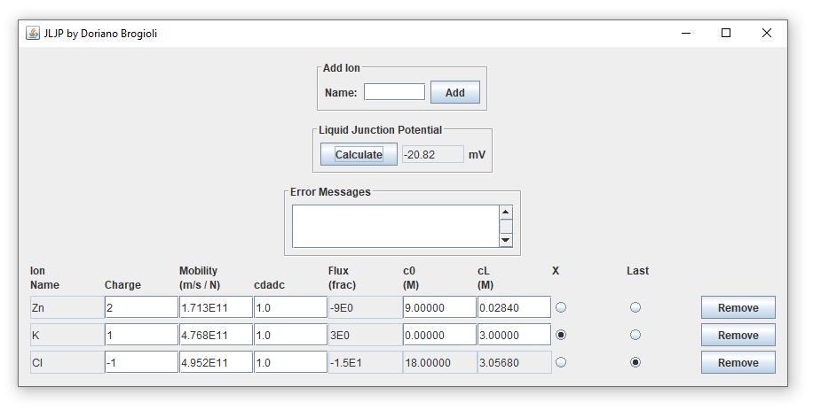

# JLJP

JLJP is a free and open-source Java application which calculates liquid junction potential (LJP) from an arbitrary number of ions. JLJP also allows the user to define ion activity as a function of concentration.

## History

JLJP was originally written by **[Doriano Brogioli](https://sites.google.com/site/dbrogioli/)** and published on [SourceForge](http://jljp.sourceforge.net/) under a [creative commons attribution license](https://creativecommons.org/licenses/by/3.0/us/) in 2013. Detailed theory underlying this application is documented in _A new open source software for the calculation of the liquid junction potential between two solutions according to the stationary Nernst-Planck equation_ ([Marino et al., 2014](https://arxiv.org/abs/1403.3640)). At the time of its creation JLJP was the only open source LJP calculator freely available on the Internet which did not limit the number of ions used in the calculation. 

**[Scott W Harden](https://github.com/swharden)** uploaded the JLJP source code to GitHub in under a [MIT license](LICENSE) (with permission from the original author) in 2020. The original version can still be found in [Releases](https://github.com/swharden/JLJP/releases). Scott modified the code to make it compile without errors on modern versions of Java, revised the documentation, lightly improved the GUI, and added unit tests to ensure LJP calculations remain accurate. The core analytical methods of JLJP have been ported to C# as the LJPmath module of the [LJPcalc](https://github.com/swharden/LJPcalc) project.

## Quickstart
* Install the [Java Platform (JDK)](https://www.oracle.com/technetwork/java/javase/downloads/)
* Ensure Java's `bin` folder is in your system path ([instructions](https://www.java.com/en/download/help/path.xml))
* Compile with `javac -nowarn Jljp.java`
* Launch the GUI with `java Jljp`
* Add ions (Zn, K, and Cl) as seen in the screenshot
* Set concentrations (c0 and cL) for each ion
* Select "X" and "Last" as shown in the screenshot
* Click "Calculate" and the liquid junction potential will be displayed

## Notes about Adding Ions

* In the graphical panel put the name of the ion in the text field and press "Add"
* Use names like `Na` and `Cl` (do not write charge as a number)
* For ions that can have various charges, use `FeII` and `FeIII`
* Each ion added will have several parameters:
  * Name: Na, Zn, Cl, etc.
  * Charge (relative to e): 1 for sodium, 2 for zinc, -1 for chlorine, etc.
  * For common ions charge and mobility are populated automatically
  * Mobility: units must be m/s / N (_not the electrokinetic mobility!_)
  * cdadc: concentration (M) at each end of the interface (see note 1)
  * phi: relative flux of the ion (automatically calculated by the program)
* You must define two ions as `x` and `last` (see note 2)

_Note 1: cdadc is the ion's concentration times the derivative of the logarithm of that ion's activity with respect to its concentration. The units of concentration and activity are M and cdadc is dimensionless. When calculating LJP for small concentrations (where ionic activity is close to concentration) this value is approximately 1.0_

_Note 2: The values of c0 and cL for the ion "last" is ignored and calculated from the values of the other ions by imposing the electro-neutrality._

## Resources

* View the [JLJP Java API](http://jljp.sourceforge.net/doc/index.html) on SourceForge

* The package can be used both as single classes ([Example.java](src/Example.java)) or a graphical interface ([Jljp.class](src/Jljp.java)).

* Typically the Henderson method is employed in commercial programs. They are often used for correcting the results of biophisical measurements. The algorithm JLJP uses is more general.

* _Comparison of Henderson's Method I and restricted maximum likelihood estimation of genetic parameters of reproductive traits_ (PMID [1886854](https://www.ncbi.nlm.nih.gov/pubmed/1886854))

* [Liquid junction potential](https://en.wikipedia.org/wiki/Liquid_junction_potential) on Wikipedia
