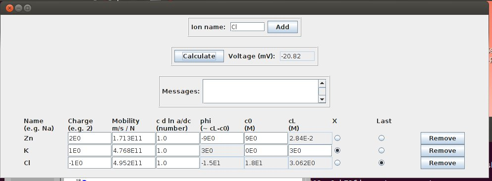

# JLJP

JLJP is a free and open-source Java application which calculates liquid junction potential (LJP) from an arbitrary number of ions. JLJP also allows the user to define activity as a function of the ion concentration.

JLJP was written by [Doriano Brogioli](https://sites.google.com/site/dbrogioli/) and originally released on [SourceForge](http://jljp.sourceforge.net/) in 2013. Detailed theory underlying this application is documented in _A new open source software for the calculation of the liquid junction potential between two solutions according to the stationary Nernst-Planck equation_ ([arXiv:1403.3640](https://arxiv.org/abs/1403.3640)). At the time of its creation JLJP was the only open source LJP calculator freely available on the Internet which did not limit the number of ions used in the calculation. Source code and documentation was repackaged for GitHub by [Scott W Harden](https://github.com/swharden) in 2020.

## Quickstart

* Install the [Java Platform (JDK)](https://www.oracle.com/technetwork/java/javase/downloads/)
* Run the jar to launch the graphical interface
* Write `Na` in the "Ion name" text field
* Press the "Add" button
* Write `Cl` in the "Ion name" text field
* Press the "Add" button
* Check the radio button under the column "X" in the row "Na"
* Check the radio button under the column "Last" in the row "Cl"
* Write `1` in the column "c0" of the row "Na"
* Write `3` in the column "cL" of the row "Na"
* Press "Calculate"
* Voltage across the liquid junction will be displayed

## Adding Ions

* In the graphical panel put the name of the ion in the text field and press "Add"
* Use names like `Na` and `Cl` (do not write charge as a number)
* For ions that can have various charges, use `FeII` and `FeIII`
* Each ion added will have several parameters:
  * Name: Na, Zn, Cl, etc.
  * Charge (relative to e): 1 for sodium, 2 for zinc, -1 for chlorine, etc.
  * For common ions charge and mobility are populated automatically
  * Mobility: units must be m/s / N (_not the electrokinetic mobility!_)
  * cdadc: concentration (M) at each end of the interface (see note 1)
  * phi: relative flux of the ion (automatically calculated by the program)
* You must define two ions as `x` and `last` (see note 2)

_Note 1: cdadc is `c*d*ln(a/dc)`, i.e. the derivative of the logarithm of the activity with respect to the concentration, multiplied by the concentration. The units of "c" and "a" are M, mole/liter. The quantity c d ln a/dc is dimensionless. In the approximation of small concentrations, the activities are close to the concentrations, and c d ln a/dc is approximately 1. It is possible to put any formula in this field, depending on the concentrations of the ions, e.g. : `3*tan(Na/Cl)`._

_Note 2: The values of c0 and cL for the ion "last" is ignored and calculated from the values of the other ions by imposing the electro-neutrality._

## Resources

* View the [JLJP Java API](http://jljp.sourceforge.net/doc/index.html) on SourceForge

* The package can be used both as single classes ([Example.java](src/Example.java)) or a graphical interface ([Jljp.class](src/Jljp.java)).

* Typically the Henderson method is employed in commercial programs. They are often used for correcting the results of biophisical measurements. The algorithm JLJP uses is more general.

* _Comparison of Henderson's Method I and restricted maximum likelihood estimation of genetic parameters of reproductive traits_ (PMID [1886854](https://www.ncbi.nlm.nih.gov/pubmed/1886854))

* [Liquid junction potential](https://en.wikipedia.org/wiki/Liquid_junction_potential) on Wikipedia
